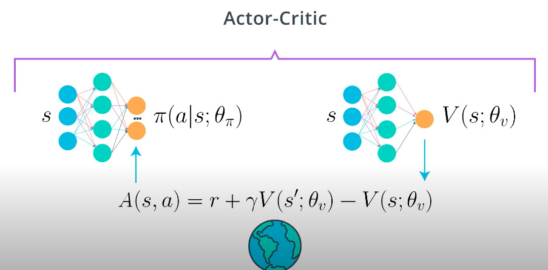
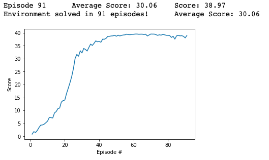

[//]: # (Image References)

[image1]: https://user-images.githubusercontent.com/10624937/43851024-320ba930-9aff-11e8-8493-ee547c6af349.gif "Trained Agent"

# Deep Reinforcement Learning Project: Continuous Control
This project aims to train an agent to move to target locations and maintain its position at the target location in a virtual environment (Reacher environment) for as many time steps as possible.

The trained agent in this project is a Deep Deterministic Policy Gradient (DDPG) based agent.

Readers are recommended to read the [DDPG](https://arxiv.org/pdf/1509.02971.pdf) and [DPG](http://proceedings.mlr.press/v32/silver14.pdf) algorithm papers to understand the theoretical background before diving into the project, it presents the theoretical foundations of the actor and critic models, update rules, tweaks such as experience replay, target networks, soft updates, etc.

![Trained Agent][image1]

This report consists of the following sections: 

* [1. Environment](#1-environment)
    
* [2. Implementation](#2-implementation)
    * [2.1 Actor-Critic model](#21-actor-critic-model)
	    * [2.1.1 Actor model](#211-actor-model)
	    * [2.1.2 Critic model](#212-critic-model)
    * [2.2 Experience replay](#22-experience-replay)
    * [2.3 OUNoise](#23-ounoise)
    * [2.4 MADDPGN Agent](#24-maddpg-agent)
    * [2.5 Training](#25-training)

* [3. Results](#3-results)

* [4. Future work](#4-future-works)


## 1. Environment

The environment chosen for the project is similar but not identical to the version of the  [Reacher Environment](https://github.com/Unity-Technologies/ml-agents/blob/master/docs/Learning-Environment-Examples.md#reacher)  from the Unity ML-Agents toolkit.
* This environment contains 20 identical agents, each with its own copy of the environment.  

	 * This version is useful for algorithms like [PPO](https://arxiv.org/pdf/1707.06347.pdf), [A3C](https://arxiv.org/pdf/1602.01783.pdf), and [D4PG](https://openreview.net/pdf?id=SyZipzbCb) that use multiple (non-interacting, parallel) copies of the same agent to distribute the task of gathering experience.
* In this environment, each double-jointed arm can move to target locations. A reward of +0.1 is provided for each step that the agent's hand is in the goal location. Thus, the goal of your agent is to maintain its position at the target location for as many time steps as possible.

* The observation space consists of 33 variables corresponding to position, rotation, velocity, and angular velocities of the arm. Each action is a vector with four numbers, corresponding to torque applicable to two joints. Every entry in the action vector should be a number between -1 and 1.

* The barrier for solving this multi-agent environemnt, taken into account the presence of many agents, is that your agents must get an average score of +30 (over 100 consecutive episodes, and over all agents).  Specifically,
  - After each episode, we add up the rewards that each agent received (without discounting), to get a score for each agent.  This yields 20 (potentially different) scores.  We then take the average of these 20 scores. 
  - This yields an **average score** for each episode (where the average is over all 20 agents).

- The environment is considered solved, when the average (over 100 episodes) of those average scores is at least +30. 


## 2. Implementation
### 2.1 Actor-Critic Model
#### 2.1.1 Actor Model
Actor model is implemented as a neural network consisting of 1 input layer, 2 fully-connected hidden layers, 1 batchnorm layer, and 1 output layer. The network can be described as follow:
* Input layer: 37 neurons (the state size)
* Fully-connected layer 1: 400 neurons, activation = ReLU
* BatchNorm layer
* Fully-connected layer 2: 300 neurons, activation = ReLU
* Output layer: 4 neurons (the action size), activation = tanh

The weight of the hidden layers are initialized based on the LeCun uniform initializer. The weight of the output layer is initialized in the range of [-3e-3, 3e-3].

The implementation can be found under the `ddpg_model.py` file.

```python
class Actor(nn.Module):
    """Actor (Policy) Model"""

    def __init__(self, state_size, action_size, seed, fc1_units=400, fc2_units=300):
        """Initialize parameters and build model.
        Params
        ======
            state_size (int): Dimension of each state
            action_size (int): Dimension of each action
            seed (int): Random seed
            fc1_units (int): Number of nodes in first hidden layer
            fc2_units (int): Number of nodes in second hidden layer
        """
        super(Actor, self).__init__()
        self.seed = torch.manual_seed(seed)
        
        self.fc1 = nn.Linear(state_size, fc1_units)
        self.bn1 = nn.BatchNorm1d(fc1_units)
        self.fc2 = nn.Linear(fc1_units, fc2_units)
        self.fc3 = nn.Linear(fc2_units, action_size)

        self.reset_parameters()

    def reset_parameters(self):
        self.fc1.weight.data.uniform_(*hidden_init(self.fc1))
        self.fc2.weight.data.uniform_(*hidden_init(self.fc2))
        self.fc3.weight.data.uniform_(-3e-3, 3e-3)

    def forward(self, state):
        """Build an actor (policy) network that maps states -> actions."""

        x = F.relu(self.bn1(self.fc1(state)))
        x = F.relu(self.fc2(x))

        return F.tanh(self.fc3(x))
```
#### 2.1.2 Critic Model
Similarly, critic model is implemented as a neural network consisting of 1 input layer, 2 fully-connected hidden layers, 1 batchnorm layer, and 1 output layer. The network can be described as follow:
* Input layer: 37 neurons (the state size)
* Fully-connected layer 1: 400 neurons, activation = ReLU
* BatchNorm layer
* Fully-connected layer 2: 300 neurons, activation = ReLU
* Output layer: 1 neuron (Q-value)

Input to the 2nd fully-connected layer consists of all the neurons from the 1st hiddent layer + 4 neurons represent the actions.

The weight of the hidden layers are initialized based on the LeCun uniform initializer. The weight of the output layer is initialized in the range of [-3e-3, 3e-3].

The implementation can be found under the `ddpg_model.py` file.

### 2.2 Experience replay

When the agent interacts with the environment, the sequence of experience tuples can be highly correlated. The naive Q-learning algorithm that learns from each of these experience tuples in sequential order runs the risk of getting swayed by the effects of this correlation. By instead keeping track of a  **replay buffer**  and using  **experience replay**  to sample from the buffer at random, we can prevent action values from oscillating or diverging catastrophically.

The  **replay buffer**  contains a collection of experience tuples (SS,  AA,  RR,  S′S′). The tuples are gradually added to the buffer as we are interacting with the environment.

The act of sampling a small batch of tuples from the replay buffer in order to learn is known as  **experience replay**. In addition to breaking harmful correlations, experience replay allows us to learn more from individual tuples multiple times, recall rare occurrences, and in general make better use of our experience.

The implementation of the **Replay Buffer** can be found under the `dqn_agent.py` file as `RelayBuffer` class.

```python
class ReplayBuffer:
    """Fixed-size buffer to store experience tuples."""

    def __init__(self, action_size, replay_buffer_size, minibatch_size, seed):
        """Initialize a ReplayBuffer object.

        Params
        ======
            action_size (int): dimension of each action
            buffer_size (int): maximum size of buffer
            batch_size (int): size of each training batch
            seed (int): random seed
        """
        self.action_size = action_size
        self.memory = deque(maxlen=replay_buffer_size)
        self.minibatch_size = minibatch_size
        self.experience = namedtuple("Experience", field_names=["state", "action", "reward", "next_state", "done"])
        self.seed = random.seed(seed)

    def add(self, state, action, reward, next_state, done):
        """Add a new experience to memory"""
        e = self.experience(state, action, reward, next_state, done)
        self.memory.append(e)

    def sample(self):
        """Randomly sample a batch of experiences from memory"""
        experiences = random.sample(self.memory, k=self.minibatch_size)

        states = torch.from_numpy(np.vstack([e.state for e in experiences if e is not None])).float().to(device)
        actions = torch.from_numpy(np.vstack([e.action for e in experiences if e is not None])).long().to(device)
        rewards = torch.from_numpy(np.vstack([e.reward for e in experiences if e is not None])).float().to(device)
        next_states = torch.from_numpy(np.vstack([e.next_state for e in experiences if e is not None])).float().to(
            device)
        dones = torch.from_numpy(np.vstack([e.done for e in experiences if e is not None]).astype(np.uint8)).float().to(
            device)

        return (states, actions, rewards, next_states, dones)

    def __len__(self):
        """Return the current size of internal memory."""
        return len(self.memory)
```
### 2.3 OUNoise
The idea of this noise is to model for the velocity of a massive Brownian particle under the influence of friction, also called a Damped Random Walk[5]. Intuitionly, this noise model is suitable to model correlated noise in robotics control, since each time step of the robot dynamic is correlated with previous and future time steps. The implementation is presented as follow and can be found under `ddpg_agent.py` as `OUNoise` class:
```python
class OUNoise:
    """Ornstein-Uhlenbeck process."""

    def __init__(self, size, seed, mu=0., theta=0.15, sigma=0.2):
        """Initialize parameters and noise process."""
        self.mu = mu * np.ones(size)
        self.theta = theta
        self.sigma = sigma
        self.seed = random.seed(seed)
        self.reset()

    def reset(self):
        """Reset the internal state (= noise) to mean (mu)."""
        self.state = copy.copy(self.mu)

    def sample(self):
        """Update internal state and return it as a noise sample."""
        x = self.state
        dx = self.theta * (self.mu - x) + self.sigma * np.array([random.random() for i in range(len(x))])
        self.state = x + dx
        return self.state
```

### 2.4 MADDPG Agent

With the above implementations, the DDPG agent is implemented in `ddpg_agent.py` as `MADDPGAgent` class.

- Replay Bufer is initialized to store the memory of the agent (`MADDPGAgent.memory`)
- Local network (`MADDPGAgent.actor_local` and `MADDPGAgent.critic_local` )  and Target network (`MADDPGAgent.actor_target` and `MADDPGAgent.critic_target`) are initialized based on the model defined above
    - `MADDPGAgent.actor_local` and `MADDPGAgent.critic_local`: these networks are used for the training process
    - `MADDPGAgent.actor_target:` and `MADDPGAgent.critic_target` these networks are used to store the weights of the local networks, and produce the action values and Q-values to makes the training stable
- `MADDPGAgent.act()` returns actions for given state as per current policy.
- `MADDPGAgent.step()` 
    - Store a step taken by the agent (state, action, reward, next_state, done) in the Memory
    - Every 20 steps ( of all the agents and if their are enough experiences available in the Replay Buffer), sample the experiences from the Replay Buffer and `learn()` from that
- `MADDPGAgent.learn()` which updates the policy and value parameters. This process follows the process described in the [Deep Reinforement Learning Nanodegree](https://www.udacity.com/course/deep-reinforcement-learning-nanodegree--nd893).

- `MADDPGAgent.soft_update()` copy the weights of the local networks to the target networks based on the rule described below:

 #### Hyper Parameters
The hyperparameters are chosen as follows:

```python
REPLAY_BUFFER_SIZE = int(1e6)   # replay buffer size
MINIBATCH_SIZE = 128            # minibatch size
GAMMA = 0.99                    # discount factor
TAU = 1e-3                      # for soft update of target parameters
LR_ACTOR = 2e-4                 # learning rate of the actor 
LR_CRITIC = 2e-4                # learning rate of the critic
WEIGHT_DECAY = 0.0              # L2 weight decay
UPDATE_EVERY = 20				# Update after this number of steps
LEARN_NUM = 10					# Number of learns
```

The hyperparameters are self-described.

### 2.5 Training

The training process is implemented in the `Continuous_Control.ipynb` notebook. The algorithm is implemented as follow:

```python
def train_ddpg(n_episodes=2000, max_t=1000, eps_start=1.0, eps_decay=1e-5, eps_end=0.1):
    """Train Agent with DDPG
    
    Params
    ======
        n_episodes (int): maximum number of training episodes
        max_t (int): maximum number of timesteps per episode
        eps_start (float): starting value of epsilon, for epsilon-greedy action selection
        eps_end (float): minimum value of epsilon
        eps_decay (float): linear factor (per episode) for decreasing epsilon
    """
    scores_window = deque(maxlen=100)
    scores = []
    
    eps = eps_start
    for i_episode in range(1, n_episodes + 1):
        env_info = env.reset(train_mode=True)[brain_name]
        states = env_info.vector_observations
        
        agent.reset()
        episode_scores = np.zeros(num_agents)
        
        for t in range(max_t):
            actions = agent.act(states, eps)
            env_info = env.step(actions)[brain_name]
            
            next_states = env_info.vector_observations
            rewards = env_info.rewards
            dones = env_info.local_done
            
            for i in range(num_agents):
                agent.step(states[i], actions[i], rewards[i], next_states[i], dones[i], t)
            
            states = next_states
            episode_scores += rewards
            
            if np.any(dones):
                break
                
            eps = max(eps_end, eps-eps_decay)
            
        score = np.mean(episode_scores)
        
        scores_window.append(score)
        scores.append(score)
        
        print('\rEpisode {}\tAverage Score: {:.2f}\tScore: {:.2f}'.format(i_episode, np.mean(scores_window), score), end="")

        if i_episode % 100 == 0:
            print('\rEpisode {}\tAverage Score: {:.2f}'.format(i_episode, np.mean(scores_window)))
            
        torch.save(agent.actor_local.state_dict(), 'checkpoint_actor.pth')
        torch.save(agent.critic_local.state_dict(), 'checkpoint_critic.pth')
        
        
        if np.mean(scores_window) >= BENCHMARK_SCORE:
            print('\nEnvironment solved in {:d} episodes!\tAverage Score: {:.2f}'.format(i_episode, np.mean(scores_window)))
            break
            
    return scores
```
## 3. Results

This section presents the result of training our DDPG agent. 

#### Training scores



## 4. Future works

As discussed in the Deep Reinforement Learning course, we can improve our results by implementing other Policy Gradient algorithms to solve this task, like PPO and SAC, and compare them with our DDPG implementation as baseline.